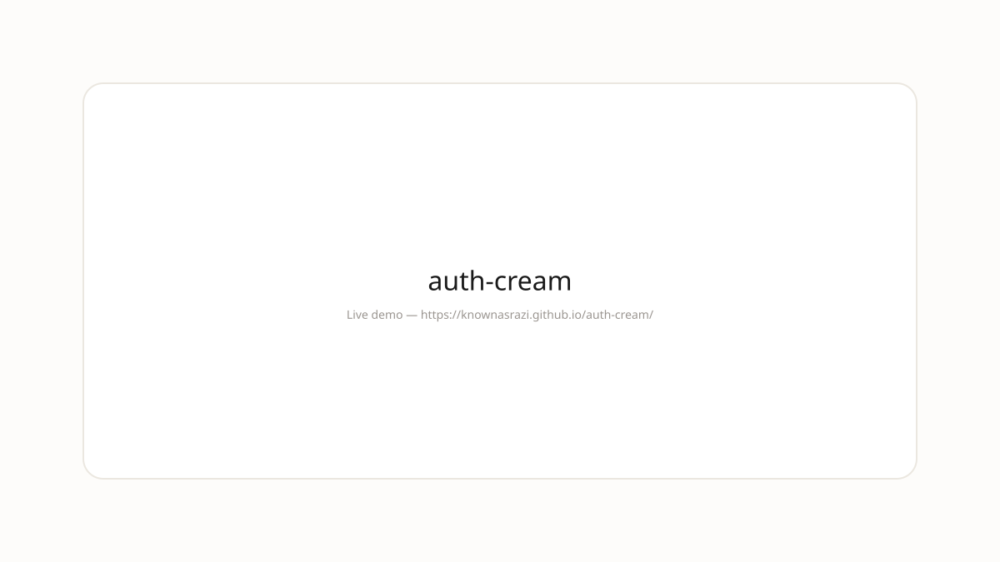

>   

---
## Demo



**Live:** https://knownasrazi.github.io/auth-cream/

> Screenshot is a placeholder — Pages deploys on push to `main`.

---


# auth-clean

**Auth clean starter - email magic link, OAuth, and session, styled minimal.**

> Auth that feels like clean.

---

## auth-clean vs the rest

| Tool | auth-clean | Others |
|------|-----------|--------|
| **Privacy** | Local-first | Cloud upload |
| **Aesthetic** | Clean, stone, ink | Neon, noise |
| **Vibe** | For coders who ship | For managers who watch |

## Stack

- NextAuth
- Built for the browser and the terminal

## Run locally

```bash
git clone https://github.com/knownasrazi/auth-clean.git
cd auth-clean
bun run dev
```

## License

[MIT](./LICENSE)
